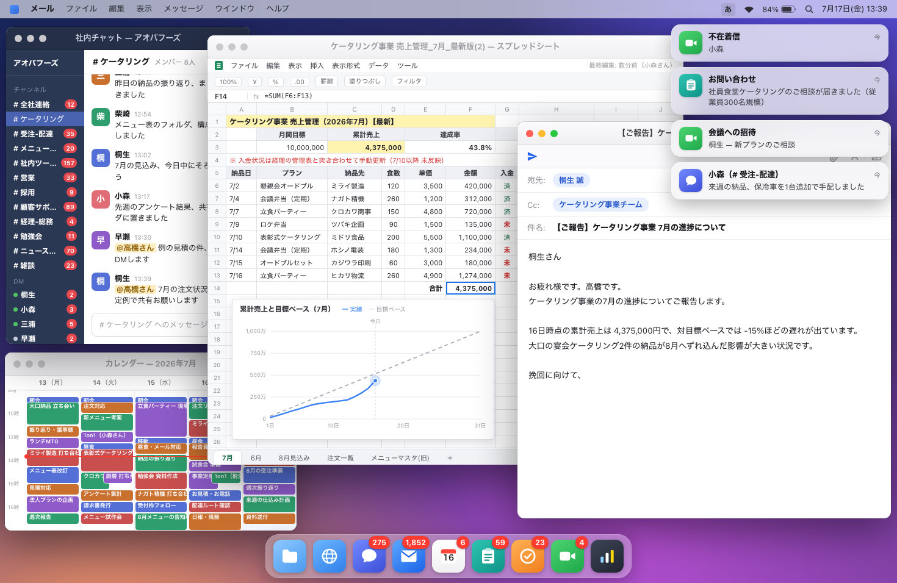

# boss-key

昔のPCゲームには、上司が通りかかった瞬間に仕事画面へ切り替える「ボスが来た」キーがあった。
boss-key はその逆をやる。
開いた瞬間、画面全体が「仕事に追われまくっているデスクトップ」になる1枚のHTMLである。



動くデモ: https://takapyyy.com/works/boss-key/demo/

- チャットには自分宛ての呼び出しが流れ込み続け、未読バッジが増えていく
- 通知バナーが右上に次々と積み上がり、ドックのアイコンが跳ねる
- 売上管理のスプレッドシートには目標未達の赤字と埋め込みグラフ
- 予定がぎっしり詰まった今週のカレンダー(ダブルブッキングあり)
- 書きかけの報告メールはクリックするとそのままタイプできる

登場する会社、人物、製品、数字はすべて架空。
チャットやメールのUIも、実在のサービスには寄せていない架空のものである。

## 使い方

1. `index.html` をブラウザで開く(サーバ不要、ネット接続不要、依存ライブラリなし)
2. `F` キーで全画面にする
3. 誰かが通りかかったら、メール本文をクリックして真剣な顔でタイプする

日本語入力がオンなら、どのキーを打ってもかな文字が入っていくので、雑に打っても画になる。

より確実に全画面にしたい場合はキオスクモードで起動する:

```bash
open -na "Google Chrome" --args --kiosk "file:///path/to/boss-key/index.html"
```

(終了は Cmd+Q)

画面は 16:10 のディスプレイにぴったり合う。
他の解像度でも自動で拡縮され、比率が違う場合は余白が黒帯になる。

## キー操作

本文にカーソルがある間はキーがすべて文字入力になるため、下記の操作は本文の外を
クリックするか `Esc` を押してから行う。

| キー | 動作 |
| --- | --- |
| F | 全画面の切り替え |
| M | 通知音の切り替え(初期状態は無音) |
| 1 / 2 / 3 | 通知の量(少なめ / ふつう / 多め) |
| B | 通知を一気に4〜6件出す(見せたい瞬間に使う) |
| T | メール本文の自動タイプの切り替え(初期は手入力。オンにすると文面が最初から打ち直される) |
| P | 一時停止 / 再開 |
| H | 操作ヒントの表示切り替え(開いて9秒で自動的に消える) |

## 見せ方のコツ

- 「ピコンピコン来ている」感じがほしいときは `3` を押すか、ここぞの瞬間に `B` を押すのが確実
- メール本文は途中まで書いてある状態から始まるので、続きを自由にタイプすればよい
- 手を動かしたくないときは `T` で自動タイプに切り替える
- 通知音はブラウザ生成の電子音。職場では無音のままをすすめる
- マウスを動かさなければポインタは自動で消える
